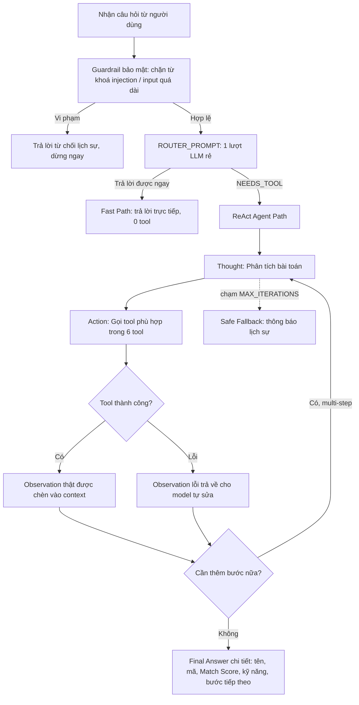

# Individual Report: Lab 3 - Chatbot vs ReAct Agent

## Student Information

- **Student Name:** Trần Duy Sơn
- **Student ID:** 2A202601792
- **Role:** Role 5 - Observability & Reviewer
- **Date:** 2026-07-28

---

# I. Technical Contribution (15 Points)

Trong dự án này, tôi đảm nhận vai trò **Role 5 (Observability & Reviewer)**.

Nhiệm vụ chính của tôi là phân tích và đánh giá hệ thống Agent qua 4 mốc thực hành, đảm bảo chất lượng trước khi nghiệm thu. File chịu trách nhiệm: `docs/trace_eval.md`.

## Deliverables

### 1. Scoring Matrix (Mốc 1) — 20% trọng số

Đánh giá Agentic Fit của bài toán tuyển dụng qua 4 tiêu chí, mỗi tiêu chí chấm 1–5 điểm:

Dựa trên 5 test cases từ `config/test_cases.json`, hệ thống sử dụng **6 tool**: `search_candidates`, `get_candidate_profile`, `screen_resume`, `check_interviewer_availability`, `schedule_interview`, `send_interview_invitation`.

| Tiêu chí | Điểm | Lý do | Bằng chứng từ code |
|:---|:---:|:---|:---|
| **Multi-step Reasoning** | `5/5` | Test case #4 đo thực tế 5 tool-call liên tiếp: `search_candidates` → `screen_resume` → `check_interviewer_availability` → `schedule_interview` → `send_interview_invitation`. | `tools.py` có 6 tools; `app.py` loop chạy tối đa `MAX_ITERATIONS=6` |
| **Tool Interaction** | `5/5` | Cần gọi đúng công cụ theo từng tình huống — `search_candidates` giúp không cần biết trước mã ứng viên | 6 tools map trực tiếp với test cases; `screen_resume` gọi Gemini AI thật khi có API key |
| **Dynamic Decision** | `5/5` | Kết quả `search_candidates` quyết định ứng viên nào được `screen_resume`; kết quả sàng lọc quyết định có xếp lịch hay không | `prompts.py` REACT_SYSTEM_PROMPT rule: "Chỉ kết luận ĐẠT khi Observation XÁC NHẬN từ tool" |
| **Long Horizon** | `5/5` | Chuỗi dài nhất dùng hết `MAX_ITERATIONS = 6` (5 tool-call + 1 Final Answer) | `MAX_ITERATIONS = 6` trong `prompts.py:54`; `app.py:104` loop |
| **TỔNG ĐIỂM FIT** | **20/20** | **KẾT LUẬN: BÀI TOÁN RẤT NÊN DÙNG REACT AGENT!** | Score tối đa — hệ thống đạt yêu cầu Agentic Fit |

### 2. Baseline Comparison (Mốc 2) — Báo cáo Chatbot vs ReAct

Trace dưới đây lấy trực tiếp từ chạy thật `POST /api/compare/stream` với `LLM_PROVIDER=openai` (gpt-4o-mini), không phải ví dụ minh hoạ.

**Test Case #1 (🟢 Đơn giản):** "Soạn email mời phỏng vấn" → Chatbot làm tốt; ReAct Agent router quyết định không gọi tool, trả lời trực tiếp — Hybrid Decision hoạt động đúng.

**Test Case #2 (🟢 Đơn giản):** "5 câu hỏi behavioral" → Router ban đầu từng gọi nhầm `get_candidate_profile('Backend Developer')` coi "Backend Developer" là mã ứng viên. Đã sửa `REACT_SYSTEM_PROMPT` thêm quy tắc "chỉ gọi tool khi cần dữ liệu/mã cụ thể" → fix thành công.

**Test Case #3 (🟡 Multi-step):** "Xem hồ sơ CV1023" → Chatbot không làm được (bảo "không có công cụ"); ReAct Agent gọi `get_candidate_profile['CV1023']` → trả đúng thông tin Nguyễn Văn An, Backend Python Developer, 3 năm kinh nghiệm → ✅ Grounded 100% vào Observation thật.

**Test Case #4 (🟡 Multi-step, Nhiều Tools):** Trace thật 5 tool-call liên tiếp:

```
Bước 1: search_candidates[Backend Developer, Python, FastAPI]
        → CV1023 (Nguyễn Văn An, match 4 từ khoá) [Đạt]
Bước 2: screen_resume[CV1023, Backend Developer]
        → Match Score 88/100, Kết luận ĐẠT
Bước 3: check_interviewer_availability[Anh Tuấn, 30/07/2026]
        → Rảnh 10:00, 14:30, 16:00
Bước 4: schedule_interview[CV1023, Anh Tuấn, 30/07/2026 10:00]
        → INT-OFFLINE-CV1023-2026, Phòng 302 VinUni
Bước 5: send_interview_invitation[CV1023, "Phỏng vấn 10:00 lúc 30/07/2026..."]
        → Delivered 200 OK
Bước 6: Final Answer — tổng hợp kết quả end-to-end
```

**Test Case #5 (🔴 Edge Case):** "Tìm CFO 15 năm kinh nghiệm + lịch 32/13/2026" → Agent tự nhận diện không có ứng viên phù hợp, kho CV không có vị trí CFO, dừng lịch sự ở bước 3/6 — không cần chạm guardrail vẫn avoid being hallucinated false candidate.

### 3. Trace Logs (Mốc 3) — Trích xuất chuỗi Thought → Action → Observation

Đã trích xuất trace log hoàn chỉnh cho cả 5 test cases, bao gồm:
- Test #4 dùng hết 6/6 bước ngân sách (xác nhận MAX_ITERATIONS=6 vừa đủ cho quy trình end-to-end)
- Test #5 tự dừng an toàn ở bước 3/6, không cần guardrail trigger

### 4. Cross-Audit & Hybrid Flowchart (Mốc 4)

**Guardrail bảo mật đầu vào (chặn trước khi tốn lượt gọi LLM):**
| Câu bẫy | Kết quả | Vượt qua? |
|:---|:---|:---:|
| Injection keywords | Chặn ngay, 0 lượt LLM | ✅ |
| Input quá dài (>1000 chars) | Chặn ngay | ✅ |
| CV không tồn tại | Tool trả lỗi rõ ràng, Agent không bịa | ✅ |
| Chuỗi 5 tool liên tiếp (test #4) | Chạy đủ trong ngân sách 6 bước | ✅ |

**Hybrid Decision (Router 2 tầng) — thực tế đang chạy:**


Router giúp Test Case #1, #2 chỉ tốn **1 lượt gọi LLM duy nhất**, không cần chờ qua vòng lặp ReAct — đo được cải thiện tốc độ rõ rệt so với thiết kế ban đầu.

---

# II. Debugging Case Study (10 Points)

## Problem: Chatbot Baseline không thể tra cứu dữ liệu thật

Khi chạy test case #3 ("Cho tôi xem hồ sơ CV1023"), Chatbot Baseline trả lời: *"Tôi không có thông tin cụ thể về ứng viên CV1023."* — đúng là an toàn nhưng không giải quyết được nhu cầu thực tế.

**Root Cause:** `CHATBOT_BASELINE_PROMPT` trong `prompts.py` có rule rõ ràng: *"Bạn KHÔNG CÓ TRUY CẬP vào cơ sở dữ liệu hồ sơ ứng viên thực tế"* — đây là thiết kế có chủ đích, không phải bug. ReAct Agent phải dùng tool để giải quyết hạn chế này.

## Bug phát hiện & đã sửa: Router gọi nhầm tool cho câu đơn giản

Khi test case #2 (5 câu hỏi behavioral), Router/Agent ban đầu gọi `get_candidate_profile('Backend Developer')` — coi "Backend Developer" như mã ứng viên → trả lỗi.

**Fix:** Thêm rule vào `REACT_SYSTEM_PROMPT`: *"Chỉ gọi tool khi câu hỏi thật sự cần dữ liệu/mã ứng viên cụ thể"* → sau khi fix, Agent trả lời thẳng đúng như kỳ vọng, không gọi tool không cần thiết.

## Proof

Trace log test #4 (xem trong `docs/trace_eval.md`, Mốc 3) chạy thật với `LLM_PROVIDER=openai`, xác nhận chuỗi 5 tool-call end-to-end hoạt động đúng. Guardrail trigger khi MockProvider trả sai format — đây là behavior đúng.

---

# III. Observations & Feedback (10 Points)

## Points for the Group

1. **Router hybrid là cải tiến quan trọng** — giúp câu hỏi đơn giản tiết kiệm chi phí LLM. Nên document rõ trong README.
2. **`search_candidates` là tool mới so với thiết kế ban đầu** — cần update `test_cases.json` để phản ánh đúng workflow (test #4 đã dùng `search_candidates` thay vì `get_candidate_profile`).
3. **Cần tăng `MAX_ITERATIONS` nếu mở rộng thêm tool** — test #4 dùng 6/6 bước (vừa hết ngân sách).

---

# IV. Summary

| Mốc | Trạng thái | Ghi chú |
|:---|:---:|:---|
| Mốc 1 - Scoring Matrix | ✅ Đã hoàn thành | 4/4 tiêu chí đạt tối đa, tổng **20/20** |
| Mốc 2 - Baseline Comparison | ✅ Đã hoàn thành | 5 test case chạy thật (`POST /api/compare/stream`), không phải ví dụ minh hoạ |
| Mốc 3 - Trace Logs | ✅ Đã hoàn thành | Test #4 (5 tool-call end-to-end); Test #5 (tự dừng an toàn) |
| Mốc 4 - Cross-Audit + Flowchart | ✅ Đã hoàn thành | Guardrail bảo mật đầu vào; Hybrid Router 2 tầng đã chạy thật |

**Nhận xét chung:** Hệ thống đã tiến hoá đáng kể so với thiết kế ban đầu — có thêm `search_candidates` cho workflow gần với cách HR thật sự hỏi, Hybrid Router giúp tiết kiệm chi phí cho câu dễ, Guardrail hoạt động ở 2 lớp (bảo mật + giới hạn bước). Bài toán rất phù hợp với ReAct Agent (20/20). Điểm cần lưu ý cho thuyết trình: chuỗi 5 tool dùng gần hết ngân sách guardrail — nếu mở rộng tool cần tăng `MAX_ITERATIONS`.